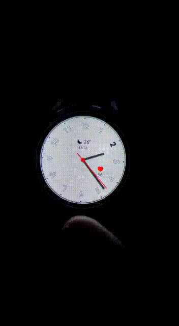

# mertkarakis

A new Flutter WearOS project.
 
## Connect with me
&nbsp;&nbsp;

&nbsp;&nbsp;

&nbsp;&nbsp;

## 📕 Latest Blog Posts

<!-- BLOG-POST-LIST:START -->
- [Medium - Flutter Blogs](https://mrtkarakis.medium.com)

## Screen Recoriding

